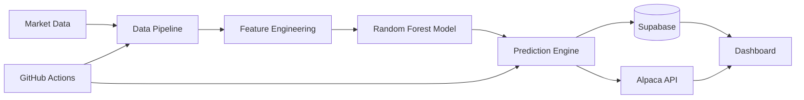

# SeerX

<p align="center">


</p>

---

## Overview

SeerX is a cloud-native algorithmic trading platform that leverages machine learning to predict stock and cryptocurrency price movements. The system automates the complete trading workflow—from collecting market data and generating predictions to logging results in a cloud database and executing paper trades through the Alpaca API.

Designed with modularity and scalability in mind, SeerX combines machine learning, cloud automation, and modern software engineering practices into a fully automated end-to-end trading system.

---

## Table of Contents

- Current Status
- Project Roadmap
- Features
- System Architecture
- Repository Structure
- Database Architecture
- Local Installation
- Running SeerX
- Cloud Automation
- Performance Metrics
- Tech Stack
- Security
- Future Work
- License

---

## Current Status

**Release Status:** Phase 5 Complete

| Component | Status |
|-----------|--------|
| Data Pipeline | Complete |
| Machine Learning Model | Complete |
| Trading Engine | Complete |
| Dashboard | Complete |
| GitHub Actions Automation | Complete |
| Documentation | Complete |

---

## Project Roadmap

| Phase | Description | Status |
|--------|-------------|--------|
| Phase 1 | Project Setup | Completed ✓ |
| Phase 2 | Data Pipeline | Completed ✓ |
| Phase 3 | Baseline Machine Learning Model | Completed ✓ |
| Phase 4 | Trading Engine | Completed ✓ |
| Phase 5 | Dashboard & Production Polish | Completed ✓ |

---

## Features

- Automated market data ingestion
- Machine learning prediction engine using Random Forest
- Stock and cryptocurrency support
- Automated paper trading via Alpaca API
- Prediction logging using Supabase
- Transaction history database
- Scheduled cloud execution with GitHub Actions
- Dashboard for monitoring predictions and trades
- Secure environment variable management
- Modular project architecture

---

## System Architecture



---

## Repository Structure

```
SeerX/
│
├── .github/
│   └── workflows/
│
├── src/
│   ├── fetch_data.py
│   ├── train_model.py
│   ├── run_trading_engine.py
│   └── test_connections.py
│
├── models/
├── requirements.txt
├── README.md
├── LICENSE
└── .gitignore
```

---

## Database Architecture

### predictions

Stores every machine learning prediction.

```sql
create table public.predictions (
  id bigint generated always as identity primary key,
  date date not null,
  symbol text not null,
  predicted_direction text not null,
  created_at timestamptz default now()
);
```

### trades

Stores every executed paper trade.

```sql
create table public.trades (
  id bigint generated always as identity primary key,
  date date not null,
  symbol text not null,
  side text not null,
  qty numeric not null,
  alpaca_order_id text,
  created_at timestamptz default now()
);
```

---

## Local Installation

```bash
git clone https://github.com/x1lde/SeerX.git

cd SeerX

python3 -m venv venv

source venv/bin/activate

pip install -r requirements.txt
```

### Environment Variables

```env
SUPABASE_URL=

SUPABASE_KEY=

ALPACA_API_KEY=

ALPACA_SECRET_KEY=
```

---

## Running SeerX

```bash
python src/test_connections.py

python src/fetch_data.py

python src/train_model.py

python src/run_trading_engine.py
```

---

## Cloud Automation

GitHub Actions schedules and automates the entire trading workflow.

Automated tasks include:

- Market data collection
- Feature generation
- Model inference
- Paper trade execution
- Prediction logging
- Trade logging

Repository Secrets Required

```
SUPABASE_URL
SUPABASE_KEY
ALPACA_API_KEY
ALPACA_SECRET_KEY
```

---

## Performance Metrics

Performance metrics will be expanded as additional backtesting and evaluation features are implemented.

| Metric | Value |
|---------|-------|
| Accuracy | Coming Soon |
| Precision | Coming Soon |
| Recall | Coming Soon |
| F1 Score | Coming Soon |
| Sharpe Ratio | Coming Soon |
| Maximum Drawdown | Coming Soon |

---

## Tech Stack

| Category | Technology |
|-----------|------------|
| Language | Python |
| Machine Learning | scikit-learn |
| Data Processing | pandas, NumPy |
| Database | Supabase (PostgreSQL) |
| Trading Platform | Alpaca API |
| Automation | GitHub Actions |
| Environment | python-dotenv |
| Version Control | Git & GitHub |

---

## Security

Sensitive credentials are stored using GitHub Secrets and local environment variables.

The following files are excluded from version control:

```
.env
venv/
__pycache__/
*.pkl
*.joblib
```

No API credentials are stored within the repository.

---

## Future Work

Planned enhancements include:

- Historical backtesting framework
- Hyperparameter optimization
- Portfolio optimization
- Risk management engine
- Position sizing strategies
- Explainable AI (SHAP)
- LSTM and Transformer models
- Interactive analytics dashboard
- Docker deployment
- Multi-model ensemble learning
- Live broker deployment

---

## License

This project is licensed under the MIT License.